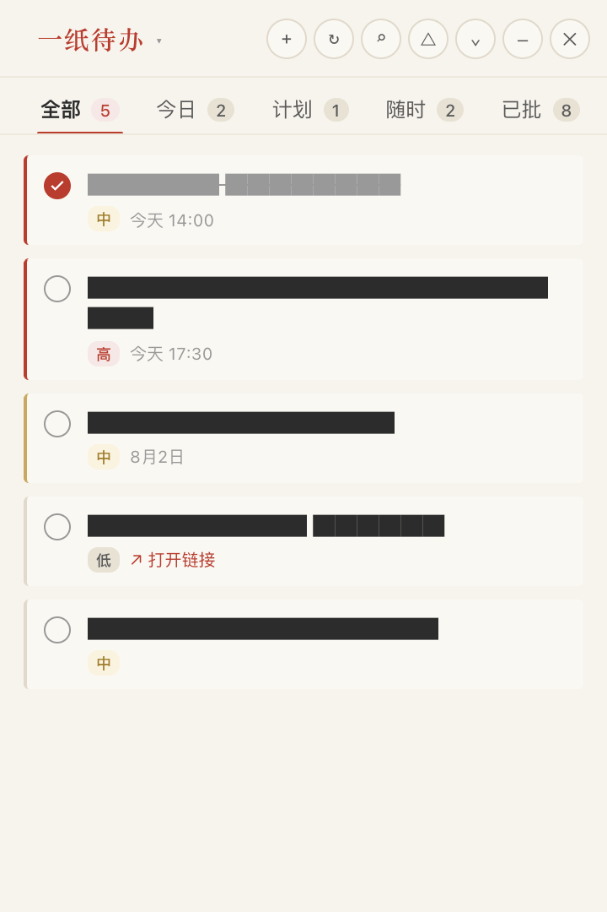
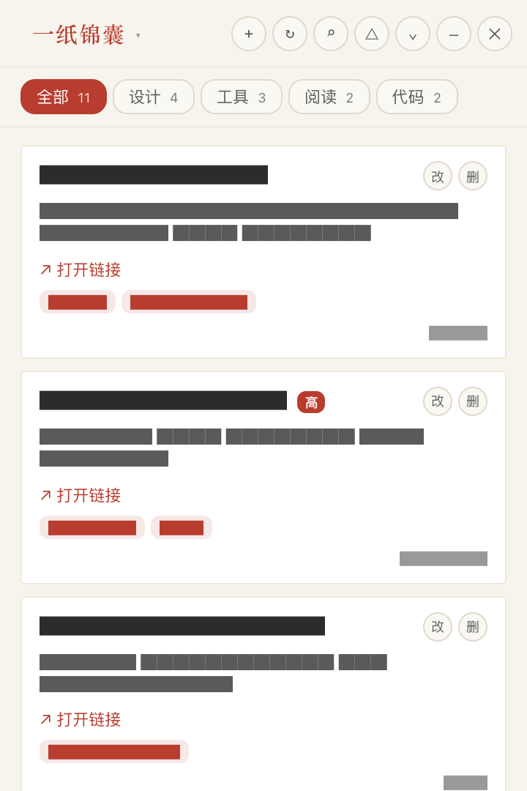

# 一纸待办

> 桌面悬浮的极简待办小组件 —— 语音新建,飞书多维表格同步,宣纸朱砂的传统视觉。

一个常显于屏幕角落的浮动窗口,任务随手记、随手批;附带 **一纸锦囊** 模块,管理网址书签与随手收藏的灵感。设计语言参考宣纸质感的米白底色与朱砂红的印章点睛,工具栏、按钮、徽章一律克制。

 

> 截图中的任务标题和书签内容已脱敏处理。

---

## 特性

- **悬浮窗** — 桌面一角常显,支持置顶 / 折叠 / 最小化 / 关闭
- **语音新建** — 内置浏览器 Web Speech API,以 `TODOList xxx` 开头即可建任务,可识别"今天 / 明天 / 后天 / 下周"等时间词
- **飞书同步** — 通过 [lark-cli](https://www.npmjs.com/package/@larksuite/cli) 读写飞书多维表格,3-5 秒同步一次
- **任务分组** — 全部 / 今日 / 计划 / 随时 / 已批 五栏
- **一纸锦囊** — 网址书签管理:名称 / 链接 / 描述 / 分类 / 标签 / 重要程度,支持按分类筛选与关键词搜索
- **跨平台** — macOS (Apple Silicon + Intel)、Windows 10/11
- **零云服务** — 数据全在你自己的飞书 Base 里,不经过任何第三方服务器

## 技术栈

- **Tauri v2** — Rust 后端 + 系统 Webview 前端,安装包小、内存占用低
- **lark-cli** — 飞书官方 CLI,免维护 OpenAPI token
- **Web Speech API** — 浏览器内置语音识别

## 安装

👉 从 [Releases](https://github.com/young920/voice-todo-float/releases) 下载对应平台的安装包。

| 平台 | 安装包 | 说明 |
|------|--------|------|
| macOS | `voice-todo-float-<version>_universal.dmg` | Universal(Apple Silicon + Intel),macOS 11+ |
| Windows | `voice-todo-float-<version>_x64-setup.exe` | NSIS 安装包,Windows 10/11 x64 |

> 也可从 [GitHub Actions 构建产物](https://github.com/young920/voice-todo-float/actions/workflows/build-tauri.yml) 取最新开发版本(版本号无 tag,不保证稳定)。

---

## 使用流程

### 步骤 1 · 安装并登录 lark-cli

应用通过 [lark-cli](https://www.npmjs.com/package/@larksuite/cli) 读写飞书多维表格,所以需要先装好它。

#### 1.1 安装(需 Node.js 18+)

```bash
npm install -g @larksuite/cli
lark-cli --version
```

#### 1.2 登录飞书账号

```bash
lark-cli auth login
```

执行后会:

1. 提示输入一个 **profile 名称**(本应用用来识别身份,例如 `personal` / `work`)
2. 弹出浏览器窗口,用飞书 App 扫码或账号密码登录
3. 凭证加密保存到本地(macOS 默认 keychain)

**多账户** 可重复执行 `auth login`,每次给一个不同名字的 profile:

```bash
lark-cli auth list               # 查看已登录的 profile
lark-cli config use-profile X    # 切换默认 profile
```

#### 1.3 macOS 专属 · 降级 keychain

> ⚠️ macOS 用户必须执行这一步,否则应用读不到凭证。

macOS 应用沙箱限制导致默认 keychain 凭证无法在沙箱外读取:

```bash
lark-cli config keychain-downgrade
```

#### 1.4 验证

```bash
lark-cli base +table-list --help
```

不应报"未登录"。

---

### 步骤 2 · 准备飞书多维表格

需要两张表:一张存任务,一张存书签(锦囊)。

#### 2.1 创建 Base

在 [飞书多维表格](https://feishu.cn/base) 新建一个 Base,打开后浏览器地址栏长这样:

```
https://feishu.cn/base/<BASE_TOKEN>?table=<TABLE_ID>
```

`<BASE_TOKEN>` 和 `<TABLE_ID>` 都要记下。

#### 2.2 任务表字段

新建一张表,**字段名必须完全一致**(包括空格):

| 字段 | 类型 | 可选值 |
|------|------|--------|
| 任务名称 | 文本 | 必填 |
| 状态 | 单选 | `待办` / `进行中` / `已完成` |
| 优先级 | 单选 | `高` / `中` / `低` |
| 截止时间 | 日期时间 | 区分"计划"与"随时",可空 |
| 备注 | 文本 | 可空 |
| 链接 | 文本 | 可空,点击外部浏览器打开 |
| 创建时间 | 日期时间 | 创建时自动写入 |
| 完成时间 | 日期时间 | 状态为"已完成"时自动写入 |

> 字段名可改,但**类型一旦选错很难改**(尤其"单选"误建成"文本"),务必确认。

#### 2.3 锦囊表字段

再建一张表(或同一个 Base 下新表):

| 字段 | 类型 | 可选值 |
|------|------|--------|
| 名称 | 文本 | 必填 |
| 链接 | 链接 | 必填,URL |
| 描述 | 文本 | 可空 |
| 分类 | 文本 | 可空,如 `工具` / `设计` / `阅读` |
| 标签 | 文本 | 可空,多个标签用**英文逗号**分隔 |
| 重要程度 | 文本 | `高` / `中` / `低` / `无`,留空表示"无" |
| 创建时间 | 日期时间 | 创建时自动写入 |

> 标签字段是普通文本(不是飞书多选标签),逗号分隔即可。重要程度也是文本,方便自定义。

---

### 步骤 3 · 安装应用

从 [Releases](https://github.com/young920/voice-todo-float/releases) 下载:

- **Windows** — 双击 `.exe`,一路 Next 完成
- **macOS** — 打开 `.dmg`,把 **一纸待办** 拖进 Applications,从启动台打开

> macOS 首次打开若提示"无法验证开发者":右键 → 打开 → 确认。

---

### 步骤 4 · 填写配置

应用启动会读 `~/.hermes/scripts/voice-todo-float/config.json`。文件不存在时会自动生成模板并退出,等你填好后再启动。

**路径:**

| 平台 | 路径 |
|------|------|
| macOS / Linux | `~/.hermes/scripts/voice-todo-float/config.json` |
| Windows | `%USERPROFILE%\.hermes\scripts\voice-todo-float\config.json` |

**手动填写(绑定自己的 Base):**

```bash
mkdir -p ~/.hermes/scripts/voice-todo-float
cat > ~/.hermes/scripts/voice-todo-float/config.json << 'EOF'
{
  "base_token": "<your_base_token>",
  "table_id": "<your_task_table_id>",
  "profile": "<your_lark_cli_profile>",
  "favorites_table_id": "<your_favorites_table_id>",
  "tags_table_id": "<placeholder>"
}
EOF
```

| 字段 | 含义 |
|------|------|
| `base_token` | 步骤 2.1 拿到的 Base 标识 |
| `table_id` | 步骤 2.2 的任务表 ID |
| `favorites_table_id` | 步骤 2.3 的锦囊表 ID |
| `tags_table_id` | 预留字段,填任意占位字符串 |
| `profile` | 步骤 1.2 中你设的 profile 名 |

> 1.0.15+ 内置了兜底默认值,config 完全缺失或字段缺失时自动用内置值填充。**只是试用请保留默认**,正经使用请改成自己的 Base / profile。

---

### 步骤 5 · 验证

启动应用后:

1. 主页应能加载任务列表(初次为空)
2. 点 "+" 新建一条,保存
3. 打开飞书 Base 刷新 —— 应能看到刚加的任务
4. 在飞书里把某条任务改为"已完成",3-5 秒后桌面端应自动勾选

**同步失败排查:**

- macOS:确认执行过 `lark-cli config keychain-downgrade`
- Windows:确认 config.json 里 `profile` 与 `lark-cli auth list` 一致
- 查看应用日志:`~/.hermes/scripts/voice-todo-float/app.log`

---

## 详细功能

### 待办

- 悬浮窗 · 置顶 / 折叠 / 最小化 / 关闭
- 分组:全部 / 今日 / 计划 / 随时 / 已批
- 语音识别建任务,自动解析"今天 / 明天 / 后天 / 下周 / 下月"
- 任务编辑、删除、状态切换、链接外部打开
- 飞书 Base 自动同步(3-5 秒)

### 一纸锦囊

- 名称 / 链接 / 描述 / 分类 / 标签 / 重要程度
- 分类筛选 + 关键词搜索(名称 / 描述 / 链接 / 标签)
- 重要程度彩色徽章;排序按 创建时间↓ → 重要程度↓
- 标签自由格式,逗号分隔

### 语音

- 任务页语音按钮或标题栏快捷入口
- 以 **"TODOList"** 开头,如 `"TODOList 明天下午三点开会,高优先级"`
- 浏览器会请求麦克风权限,首次需授权

---

## 开发

### 本地构建

需要:

- **Rust** stable([rustup](https://rustup.rs/))
- **Node.js** 20+
- **macOS**:Xcode Command Line Tools(`xcode-select --install`)
- **Windows**:Visual Studio Build Tools + NSIS(`choco install nsis`)

```bash
git clone https://github.com/young920/voice-todo-float.git
cd voice-todo-float
npm install

npm run dev         # 开发模式(热重载)
npm run build-mac   # macOS .dmg
npm run build-win   # Windows .exe
```

产物路径:`src-tauri/target/<target-triple>/release/bundle/`

### 项目结构

```
.
├── src/                  # 前端 UI(单文件 index.html)
├── src-tauri/            # Rust 后端
│   ├── src/main.rs
│   ├── Cargo.toml
│   └── tauri.conf.json
└── .github/workflows/    # GitHub Actions 构建
```

---

## FAQ

<details>
<summary><b>Q: 启动后弹"未配置锦囊表 ID"</b></summary>

`config.json` 缺 `favorites_table_id`。升级到 1.0.15+ 会自动用内置默认值补全;想用自己的表,按"步骤 4"补字段后重启应用。
</details>

<details>
<summary><b>Q: macOS 报"未授权访问 keychain"或应用打不开</b></summary>

执行 `lark-cli config keychain-downgrade` 后重启应用。
</details>

<details>
<summary><b>Q: 任务加进去飞书里看不到</b></summary>

1. `lark-cli auth list` 确认 profile 已登录
2. 检查 config.json 的 `base_token` / `table_id` / `profile` 是否正确
3. 看 `~/.hermes/scripts/voice-todo-float/app.log`
4. 飞书 Base 有 ~3 秒同步延迟,稍等刷新
</details>

<details>
<summary><b>Q: 如何换 Base / 多账户</b></summary>

编辑 `config.json` 的 `base_token` / `table_id` / `profile`,重启应用。多账户先 `lark-cli auth login` 加 profile,再切换 config 的 `profile` 字段。
</details>

<details>
<summary><b>Q: 语音识别不工作</b></summary>

浏览器内置 Web Speech API 需要联网,且仅 Chromium 内核支持。
- macOS:Chrome / Edge / Brave(不要用 Safari)
- Windows:Edge / Chrome / Brave
- 首次需授权麦克风权限
</details>

---

## 路线图

见 [CHANGELOG.md](./CHANGELOG.md) 的 Planned 段。下一阶段:

- Chrome / Firefox HTML 书签导入 → 锦囊
- 截止时间前的本地提醒

---

## 致谢

- 设计语言:宣纸 + 印章红的传统中式文档质感
- 框架:[Tauri](https://tauri.app)
- 数据同步:[lark-cli](https://www.npmjs.com/package/@larksuite/cli)

## License

MIT